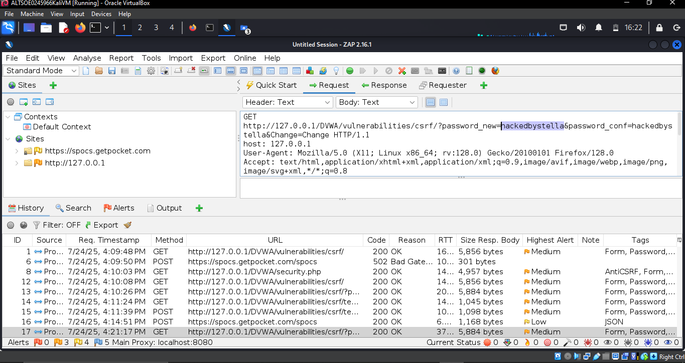
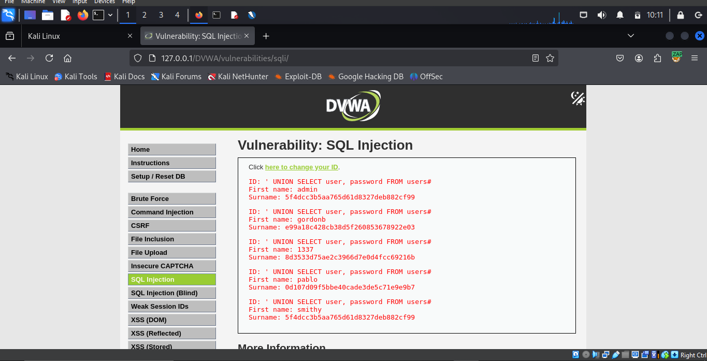
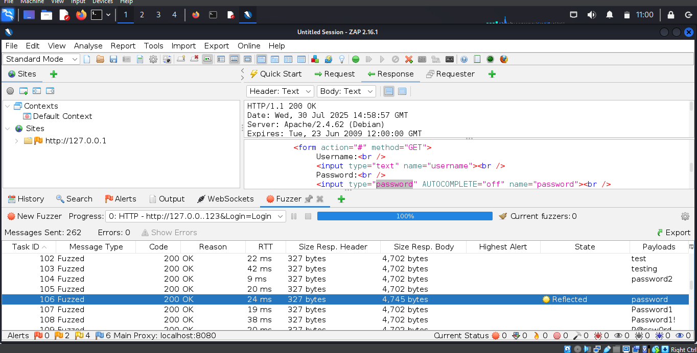

# Future Interns Task 1: Web Application Vulnerability Assessment
## 📄 Report Access
Download the file report titled **FUTURE_CS_01** from the `my-files` directory here on GitHub or [click here to view the report document](https://docs.google.com/document/d/19hg6FjgMA2A8bazAmP3Q1tppQr-5Vz4O4PAlmmbsn4M/edit?usp=drivesdk).

## 🎥 Video Walkthroughs

### 1. Cross-Site Request Forgery (CSRF) Walkthrough   
  
▶️ [Watch SQL Injection Video](https://www.loom.com/share/a9108c6222db4738846342a406bf700a)

### 2. SQL Injection Attack Walkthrough  
  
▶️ [Watch CSRF Video](https://drive.google.com/file/d/your-csrf-video-link-here/view)

### 3. Brute Force Attack Walkthrough  
  
▶️ [Watch Brute Force Video](https://www.loom.com/share/9c4a6c3f034940b5a42b1c251619545f)

## Project Overview

This hands-on cybersecurity internship project involved a vulnerability assessment of a deliberately vulnerable web application—**Damn Vulnerable Web Application (DVWA)**. The project simulates real-world client work for startups and SaaS platforms seeking to secure their web applications.  

The objective was to discover and exploit common web vulnerabilities using ethical hacking tools and OWASP Top 10 standards, then compile a professional security assessment report.

## Tasks Performed

- Set up and explored the **DVWA** environment
- Configured **OWASP ZAP** and **FoxyProxy** for proxy-based interception
- Performed manual and automated vulnerability scans
- Identified and exploited vulnerabilities:
  - SQL Injection (SQLi)
  - Cross-Site Request Forgery (CSRF)
  - Brute Force Attack
- Mapped findings to the **OWASP Top 10**
- Documented each vulnerability with:
  - Screenshots and payloads
  - Impact severity (High / Medium)
  - Remediation advice

## Skills Gained

- Web Application Vulnerability Scanning  
- Security Documentation & Reporting  
- OWASP Top 10 Threat Mapping  
- Basic Ethical Hacking Techniques  
- Threat Modeling & Risk Analysis
  
## 📄 Report Contents

- Executive Summary  
- Technical Setup & Tools Used  
- Vulnerability Findings  
- Exploitation Walkthroughs  
- Screenshots with Payloads  
- Impact Analysis  
- Security Recommendations  

> 📂 All report files and evidence are included in this repository for review or demonstration purposes.

